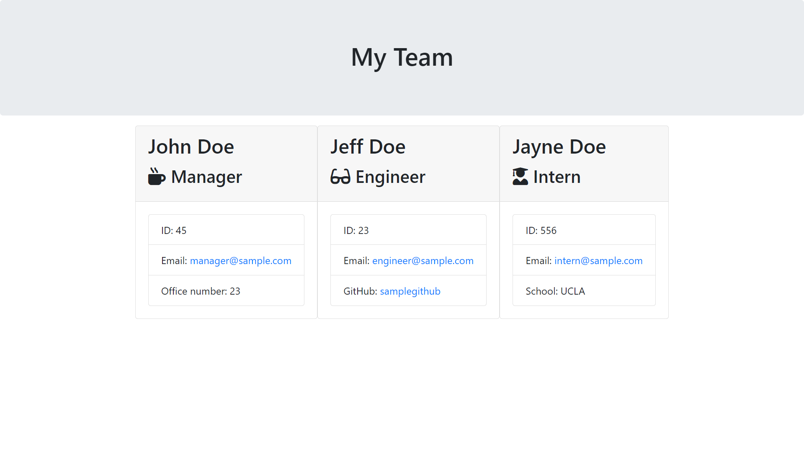

# Team Profile Generator

A Node.js profile generator for employees of a software engineering company.

## Table of contents

- [General info](#general-info)
- [Screenshots](#screenshots)
- [Technologies](#technologies)
- [Setup](#setup)
- [Live Application](#live-application)
- [Features](#features)
- [Status](#status)
- [Inspiration](#inspiration)
- [Contact](#contact)

## General info

Made to practise Node.js with the inquirer package and Test Driven Development with the Jest package. Also Object Oriented Programming using parent classes and constructors as well as creating files using the File System.

## Screenshots

## Technologies

- HTML
- CSS
- JavaScript
- Node.js
- Inquirer Package
- Jest

## Setup

- Install Node.js
- Run 'npm i inquirer@^8.0.0' in the terminal to install Inquirer Package
- Run 'npm i jest' in the terminal to install the Jest test suite
- Pull the repository to your computer
- Open node and from the root directory run 'node index.js'

## Live Application

N/A

## Features

List of features ready and TODOs for future development

- Creates Employees based on user inputs from the prompts in the terminal

## Status

Project is: _finished_

## Contact

Created by [billsboroughscott@gmail.com] - feel free to contact me!
